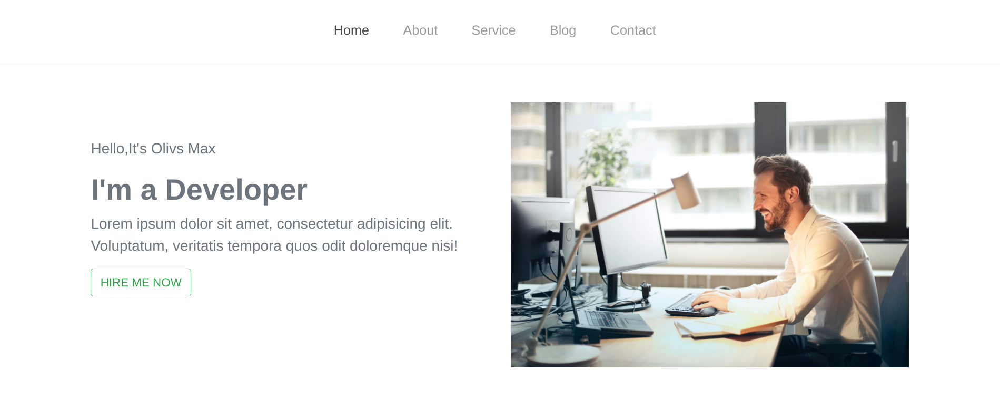
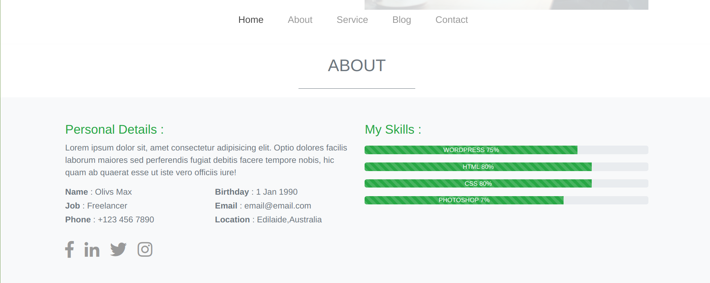

## Portfolio template 

[Get a live experience here...](https://mohiuddinrabby.github.io/Portfolio-template/)

This repo contains an easy-to-customize personal portfolio template that was created with HTML,CSS,BOOTSTRAP . It is lightweight and fully responsive, as well as comes with the Bootstrap grid system and loaded with Font Awesome. The site is static and comes production ready if you just want to add your information and go. Alternatively, you can edit styles, colours, and scripts fairly easily. The site was built as modular as possible to make it easy to shift around styles and content.

----
 

 
 

